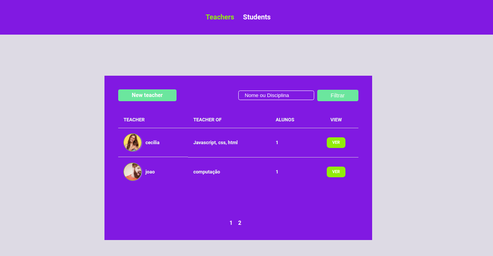

# Cadastro Escolar


<h1 align="center">
    
</h1><br><br>


  ## 📚 Sobre a FASE 3

  Nessa fase, estudamos como persistir os dados da aplicação no qual esse termo significa guardar os dados em aum local mais seguro "BD". Para isso, desenvolvemos um app onde podemos criar dados de professores e alunos. Assim, podemos cadastrar, editar, deletar e relacionar tabelas.<br><br>

 <h1 align = center>
    
</h1>

  ## 💻 Tecnologias utilizadas
  - HTML
  - CSS
  - JavaScript
  - Node.Js
  - Nunjucks
  - Express
  - Nodemon
  - BrowserSync
  - PostgreSQL
  - Npm - Gerenciador de pacotes

---


## 💻 Como baixar o projeto 

```bash

    # Clonar o repositório atraves GitHub Desktop
    $ git clone https://github.com/NatanSiilva/cadastro-escolar

    # Entrar no diretório
    $ cd clone-da-Rocketseat

    # Instalar as dependêcias
    $ npm install 

    # Iniciar o projeto
    $  npm start
```


## 💻 Dificuldades 

Como foi o meu primeiro contato com novas ferramentas e tecnologias diferentes, minha cabeça acabou dando varios if() com tantos termos e funcionalidades desconhecidas, confesso que o Inglês também foi o problema no entanto tenho me esforçado a melhorar. Com todo esse laços de dúvidas por várias vezes me peguei pensando e repensando se estava no caminho certo, até mesmo pensei em desistir. Após varios dias e horas gastas em várias aulas, acabei não só concluido a fase 3, mais também entendendo tudo aquilo que foi ensinado.

<p align= center>
🐱‍👤 Desenvolvido por <strong>Natanael Silva</strong>   -----   Me adicione no <a href="https://www.linkedin.com/in/natanael-silva-33b374188/"target="_blank">Linkedin</a>
</p>